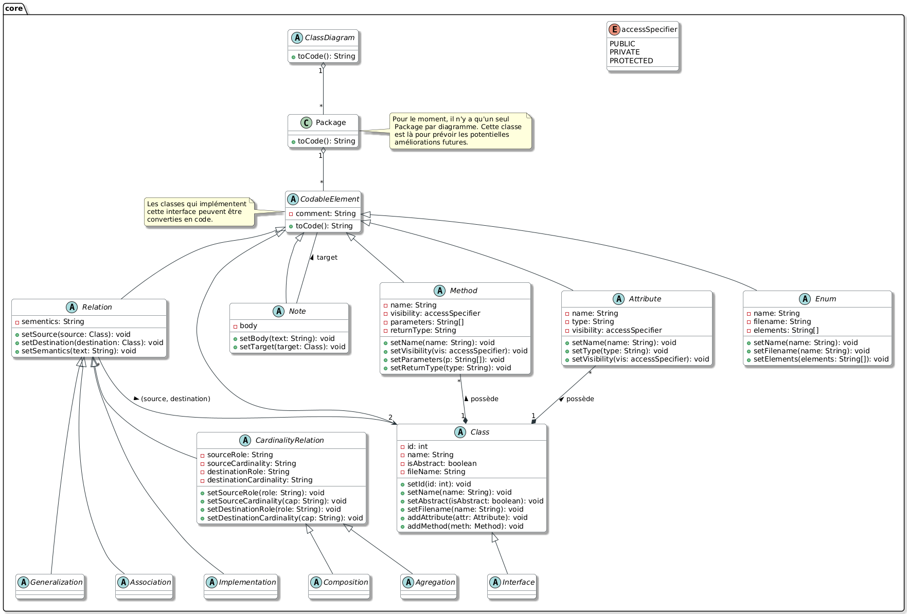
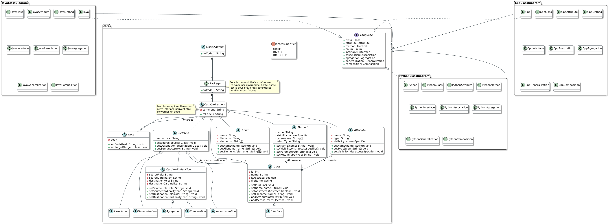

# Générateur de Code Multi-Langages depuis PlantUML
## Version 1.0
### Auteurs : MEZINO Thomas, GALY Reichmann, GUILLIER Yaële


Ce projet est un outil en ligne de commande permettant de générer automatiquement du code source orienté objet (**C++**, **Java**, et **Python**) à partir d'un diagramme de classes au format **PlantUML** (`.puml`). 

Il a été développé en équipe dans le cadre d'un projet académique, avec pour objectif de mettre en pratique les concepts de conception logicielle et les Design Patterns.

## 🏗️ Architecture du Projet

Le cœur de notre générateur repose sur le **Design Pattern Abstract Factory**. 
Cette architecture nous permet de découpler totalement la logique d'analyse du diagramme (le Parser) de la logique de génération de code. 

- **Le Parser (`PlantUMLParser`)** lit le fichier `.puml` et construit un Arbre Syntaxique Abstrait (AST) en mémoire (représentant les classes, interfaces, méthodes, attributs et relations).
- **Les Factories (`Cpp`, `Java`, `Python`)** implémentent une interface commune pour traduire cet AST dans la syntaxe spécifique de leur langage cible.

Cette conception rend notre outil hautement extensible : ajouter un nouveau langage (comme C# ou PHP) ne nécessite aucune modification du parser existant.

### 📊 Diagrammes de Classe

Voici les diagrammes UML modélisant l'architecture de notre outil :

**1. Architecture Core (Le Parser et le Modèle Abstrait) :**


**2. Architecture Complète (avec les Factories d'implémentation) :**


## 🚀 Fonctionnalités Supportées

Le générateur est capable de détecter et de traduire les éléments UML suivants :
* **Classes et Classes Abstraites** (avec destructeurs virtuels automatiques en C++).
* **Interfaces** (traduites via `implements` en Java, héritage multiple en Python, et classes virtuelles pures en C++).
* **Énumérations** (`enum`).
* **Attributs et Méthodes** avec leurs types, types de retour, paramètres et visibilités (`public`, `private`, `protected`).
* **Relations UML :**
    * Héritage (Généralisation) : `--|>` ou `<|--`
    * Implémentation : `..|>` ou `<|..`
    * Composition : `*--` ou `--*`
    * Agrégation : `o--` ou `--o`
    * Association : `-->`, `<--`, `--`

## ⚠️ Limites et Travaux Futurs

Afin d'être totalement transparents sur l'état d'avancement du projet, il est important de noter que certaines fonctionnalités présentes sur nos diagrammes de classe théoriques n'ont pas été implémentées dans le code final :
* **Cardinalités / Multiplicités :** Bien que prévues dans notre architecture conceptuelle, les cardinalités (ex: `1..*`, `0..1`) accompagnant les relations ne sont pas encore traduites sous forme de collections (Listes, Tableaux) dans le code généré.
* **Packages :** Nous avons prévu dans notre architecture la gestion des packages pour une amélioration future. Pour le moment, ce n'est pas géré.

## ⚙️ Prérequis

* **Python 3.x** installé sur votre machine.
* **Make** (Optionnel, mais recommandé pour exécuter les tests automatisés).

## 🛠️ Utilisation Manuelle

Vous pouvez utiliser le script principal `uml2code.py` en ligne de commande de la manière suivante :

```bash
python3 uml2code.py -l <Langage> -o <Dossier_Sortie> <Fichier_Entree.puml>

```

**Arguments :**

* `-l` ou `--language` : Le langage cible de génération (**Cpp**, **Java**, ou **Python**).
* `-o` ou `--output` : Le dossier où les fichiers générés seront sauvegardés.
* `fichier.puml` : Le chemin vers votre diagramme PlantUML.

**Exemple :**

```bash
python3 uml2code.py -l Java -o ./output ./tests/model.puml

```

## 🧪 Tests et Démonstration (Makefile)

Pour faciliter l'évaluation et démontrer le bon fonctionnement de notre outil sur les trois langages simultanément, nous avons mis en place un `Makefile`.

Assurez-vous d'avoir un fichier de test valide dans `tests/model.puml`, puis exécutez simplement :

```bash
make test
# ou simplement
make

```

Cette commande va :

1. Créer automatiquement un dossier `tests/output/`.
2. Lancer le générateur pour le C++.
3. Lancer le générateur pour le Java.
4. Lancer le générateur pour le Python.
5. Placer tous les fichiers générés dans le dossier de sortie.

Pour nettoyer les fichiers de test générés, utilisez :

```bash
make clean

```

