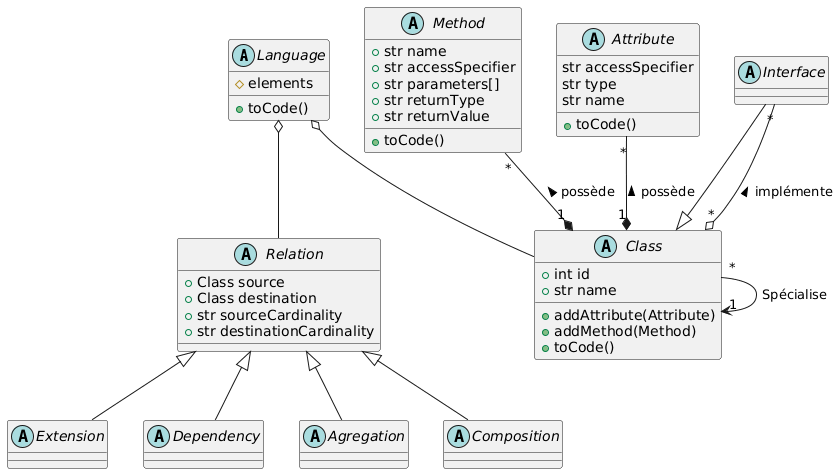

# Uml2Code

#### Auteurs : MEZINO Thomas, GALY Reichmann, GUILLIER Yaële

Un petit projet de cours dont l'objectif est de transformer un diagramme (pour l'instant uniquement diagramme de classe) UML en code.
Nous avons décidé d'implémenter les 3 langages suivants :
- ?
- ?
- ?

## Architecture du code

Voici l'architecture que nous allons utiliser pour réaliser notre projet :

